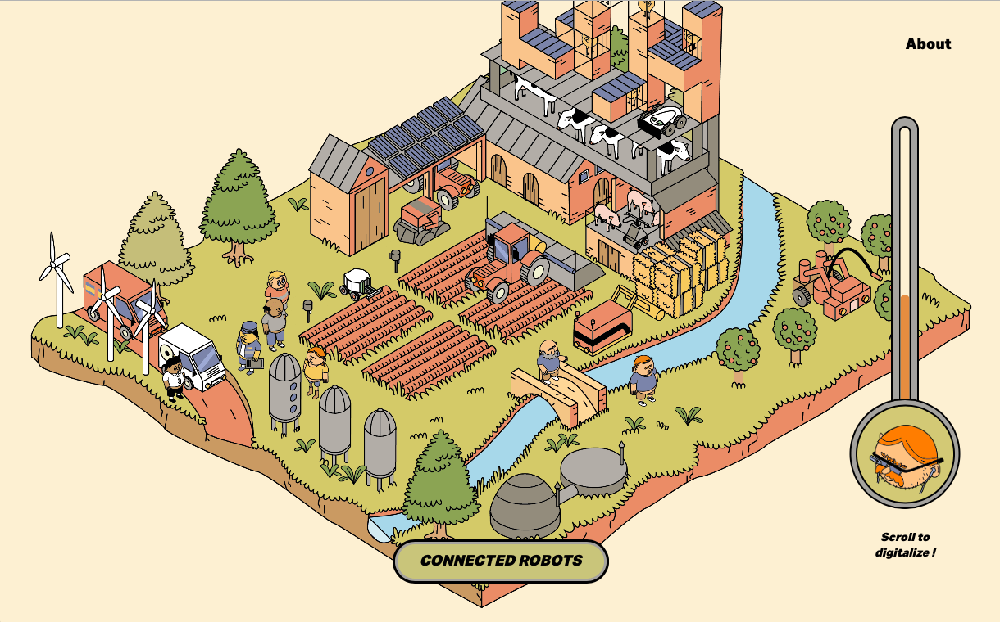

# Agriveille
> Funny website to present a monitoring about connected agriculture . 




## Installation

### Install Dependencies
```sh
npm install
```

### Run Server on localhost:8080
``` bash
npm run dev
```

### Build your app
``` bash
npm run build
```

## Built With

* [Scss](http://sass-lang.com/) - Sass is the most mature, stable, and powerful professional grade CSS extension language in the world.
* [NPM](https://www.npmjs.com/) - Package manager. Installs, publishes and manages node programs.
* [Webpack](https://webpack.js.org/) - Webpack is a module bundler for modern JavaScript applications.
* [Vue.js](https://vuejs.org/) - An open-source JavaScript framework for building user interfaces.
* [Pixi.js](http://www.pixijs.com/) - Create beautiful digital content with the fastest, most flexible 2D WebGL renderer.

## Meta

Nikita Skargovskii – [@nskargovskii](https://twitter.com/nskargovskii) – [https://github.com/nikitaska](https://github.com/nikitaska/)

Nathalie Zhang – [https://github.com/nathaliezhang](https://github.com/nathaliezhang/)

Arnaud Pinot – [@PinotArnaud](https://twitter.com/PinotArnaud) – [https://github.com/arnvvd](https://github.com/arnvvd/)